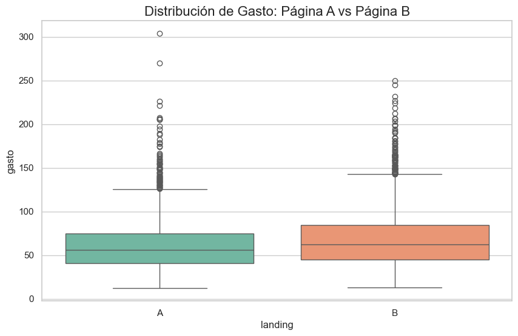
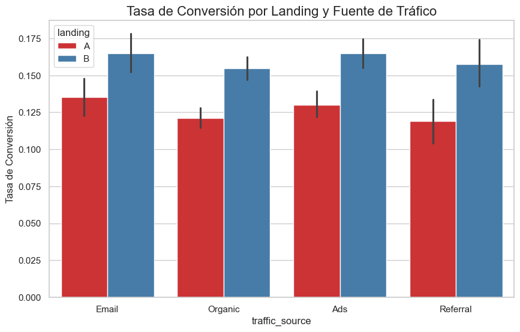
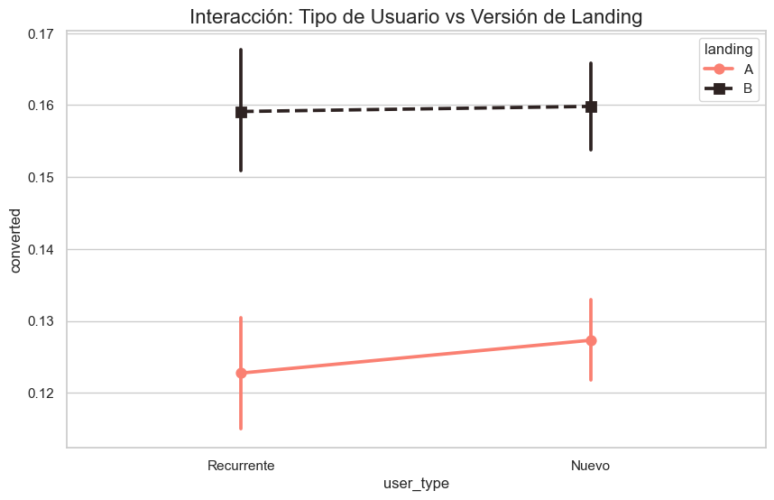

# 🚀 Análisis de Experimento A/B: Optimización de Landing Page

Este repositorio contiene un análisis exhaustivo de un **experimento A/B** diseñado para evaluar la efectividad de una nueva versión de landing page (Página B) frente a la original (Página A). El objetivo principal fue determinar el impacto tanto en la **tasa de conversión** como en el **valor promedio de transacción (Ticket Promedio)**.

---

## 📊 Resumen Ejecutivo (KPIs Maestros)

Tras analizar una muestra auditada de **40,000 usuarios**, los resultados indican que la **Página B es significativamente superior** en todas las métricas clave:

| Métrica | Página A (Control) | Página B (Variante) | Mejora (Lift) |
| :--- | :---: | :---: | :---: |
| **Tasa de Conversión** | 12.57% | **15.96%** | **+26.96%** |
| **Gasto Promedio** | $61.09 | **$68.75** | **+12.54%** |

---

## 🧪 Metodología Estadística

Para garantizar que los resultados no fueran producto del azar, se aplicaron pruebas de hipótesis con un nivel de significancia del 5% ($\alpha = 0.05$):

1.  **Comparación de Gasto (Ticket Promedio):**
    *   Se validó la igualdad de varianzas mediante la prueba de **Levene**, detectando una dispersión significativamente distinta.
    *   Se aplicó la prueba **t de Welch** (`equal_var=False`), obteniendo un $p$-valor de **1.06e-20**, lo que confirma que los usuarios de la Página B gastan más de forma consistente.
2.  **Comparación de Conversión:**
    *   Se utilizó un **Z-Test de Proporciones**, resultando en un $p$-valor de **0.0000**. La Página B convierte significativamente mejor a los visitantes.
3.  **Análisis de Variables Categóricas (Chi-cuadrado):**
    *   **Fuente de Tráfico:** Existe una asociación significativa entre el canal de origen y la conversión ($p=0.034$).
    *   **Tipo de Usuario:** No se encontró evidencia de que el comportamiento de conversión varíe según si el usuario es Nuevo o Recurrente ($p=0.473$).

---

## 📈 Visualización de Hallazgos

### 💰 1. Distribución de Gasto por Landing
El análisis visual confirma que la Página B no solo genera más ventas, sino que estas se concentran en un rango de valor superior (ticket promedio más alto).

### 🎯 2. Eficiencia por Fuente de Tráfico
Se identificó que los canales de **Email** (~14.99%) y **Ads** (~14.73%) son los más efectivos. Sin embargo, la Página B logra elevar el rendimiento en absolutamente todos los canales.

### 👤 3. Interacción: Tipo de Usuario vs Landing
La superioridad de la Página B es **transversal**: es igual de efectiva captando usuarios nuevos como reteniendo a usuarios recurrentes, lo que simplifica la implementación comercial.

---

## 💡 Conclusiones y Recomendaciones Económicas

1.  **Implementación Definitiva:** Se recomienda migrar el 100% del tráfico a la **Página B**. El impacto combinado de mayor conversión y mayor ticket promedio representa un crecimiento sustancial en el ROI.
2.  **Estrategia de Canales:** Dado su alto rendimiento, se sugiere incrementar la inversión publicitaria en **Email Marketing y Ads**, apalancándolos con el diseño de la Versión B.
3.  **Propuesta de Valor Universal:** La landing page es robusta; no requiere personalización diferenciada por tipo de usuario en esta etapa, lo que reduce costos operativos de marketing.

---

## 🛠️ Tecnologías Utilizadas
*   **Lenguaje:** Python 3.x
*   **Librerías de Análisis:** Pandas, Scipy.stats, Statsmodels
*   **Visualización:** Matplotlib, Seaborn

---
## Autor

David Germán Ramos Rodríguez
[LinkedIn](https://www.linkedin.com/in/david-g-ramos/) |
[Portfolio](https://dataanalist-davidgramos.github.io/mi-sitio-web/)
